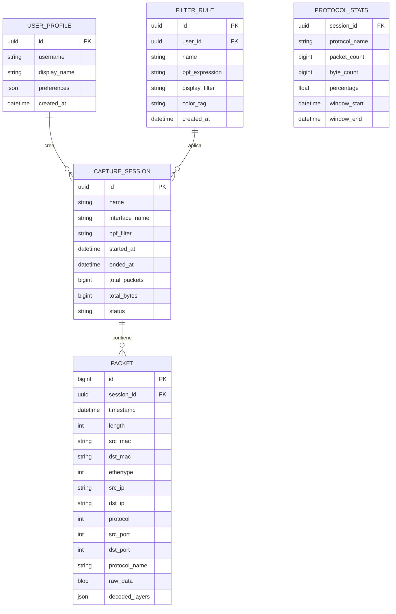

# Arquitectura Técnica Completa — NexusSniff

> Analizador de paquetes de red para interceptación y diagnóstico profundo de tráfico en tiempo real.

---

## 1. Stack Tecnológico Recomendado

### Motor de Captura (Backend de alto rendimiento)

| Componente | Tecnología | Justificación |
|---|---|---|
| **Lenguaje** | **C++20** | Rendimiento nativo para procesar miles de paquetes/seg sin overhead de GC; requisito obligatorio del proyecto. |
| **SDK de captura** | **Npcap SDK** | Driver estándar de facto en Windows para captura a nivel de enlace (reemplaza a WinPcap). |
| **Binding Python** | **pybind11** | Permite exponer el motor C++ como `.pyd` que Python importa directamente, con coste mínimo de marshalling. |
| **Build System** | **CMake 3.20+** | Sistema de compilación multiplataforma; integración nativa con MSVC, pybind11 y Npcap. |

### Aplicación de Escritorio (Frontend)

| Componente | Tecnología | Justificación |
|---|---|---|
| **Lenguaje** | **Python 3.12+** | Alto ecosistema, rápido desarrollo de UI, integración directa con el módulo `.pyd` de C++. |
| **Framework UI** | **PyQt6** | Framework maduro para apps de escritorio con soporte nativo de temas, widgets avanzados y Dark Mode. |
| **Gráficas en Tiempo Real** | **pyqtgraph** | Renderizado GPU-acelerado para visualizar estadísticas de red en tiempo real (throughput, latencia, distribución de protocolos). |
| **Comunicación Hilo-UI** | **QThread + Signals/Slots** | Patrón nativo de Qt para mantener la UI responsiva mientras el motor C++ captura en segundo plano. |

### Persistencia de Datos

| Componente | Tecnología | Justificación |
|---|---|---|
| **BD Relacional** | **PostgreSQL 16** | Almacena configuraciones de usuario, perfiles de captura, reglas de filtrado y metadatos de sesión. |
| **BD Analítica** | **ClickHouse** | Motor columnar optimizado para queries analíticas sobre millones de paquetes capturados (historial). |
| **Cache** | **Redis 7** | Cache de estadísticas en caliente y cola de mensajes para desacoplar captura ↔ almacenamiento. |

### Infraestructura

| Componente | Tecnología | Justificación |
|---|---|---|
| **Contenedores** | **Docker + Docker Compose** | Orquesta PostgreSQL, ClickHouse y Redis con un solo comando; entorno reproducible. |
| **CI/CD** | **GitHub Actions** | Pipeline de build automatizado: compilar C++, tests, empaquetado del instalador. |
| **Instalador** | **PyInstaller + NSIS** | Empaqueta la app Python + módulo C++ en un instalador `.exe` para distribución en Windows. |
| **Testing** | **GoogleTest (C++) / pytest (Python)** | Frameworks estándar para testing unitario en ambos lenguajes. |

---

## 2. Estructura de Carpetas del Proyecto

```
NexusSniff/
├── CMakeLists.txt                  # Raíz del build system
├── README.md
├── LICENSE
├── .gitignore
├── docker-compose.yml              # PostgreSQL + ClickHouse + Redis
├── requirements.txt                # Dependencias Python
│
├── engine/                         # ══ Motor de captura C++ ══
│   ├── CMakeLists.txt
│   ├── include/
│   │   └── nexus/
│   │       ├── capturer.hpp        # Clase principal de captura
│   │       ├── decoder.hpp         # Decodificador de protocolos (Eth/IP/TCP/UDP/etc.)
│   │       ├── filter.hpp          # Motor de filtros BPF
│   │       ├── packet.hpp          # Estructura de paquete decodificado
│   │       ├── session.hpp         # Gestión de sesión de captura
│   │       ├── stats.hpp           # Estadísticas en tiempo real
│   │       └── types.hpp           # Tipos y constantes comunes
│   ├── src/
│   │   ├── capturer.cpp
│   │   ├── decoder.cpp
│   │   ├── filter.cpp
│   │   ├── packet.cpp
│   │   ├── session.cpp
│   │   └── stats.cpp
│   ├── bindings/
│   │   └── py_nexus.cpp            # Bindings pybind11 → módulo nexus_engine.pyd
│   └── tests/
│       ├── CMakeLists.txt
│       ├── test_decoder.cpp
│       ├── test_filter.cpp
│       └── test_packet.cpp
│
├── app/                            # ══ Aplicación de escritorio Python ══
│   ├── __init__.py
│   ├── main.py                     # Punto de entrada
│   ├── core/
│   │   ├── __init__.py
│   │   ├── capture_worker.py       # QThread que invoca nexus_engine
│   │   ├── packet_model.py         # QAbstractTableModel para la tabla de paquetes
│   │   ├── export_manager.py       # Exportar capturas a PCAP / CSV / JSON
│   │   └── db_manager.py           # Conexión a PostgreSQL y ClickHouse
│   ├── ui/
│   │   ├── __init__.py
│   │   ├── main_window.py          # Ventana principal
│   │   ├── capture_panel.py        # Panel de captura en vivo
│   │   ├── detail_panel.py         # Inspector de paquete (capas OSI)
│   │   ├── hex_view.py             # Vista hexadecimal
│   │   ├── stats_panel.py          # Dashboard de estadísticas en tiempo real
│   │   ├── filter_bar.py           # Barra de filtros tipo Wireshark
│   │   └── settings_dialog.py      # Configuración de la aplicación
│   ├── themes/
│   │   ├── dark.qss                # Hoja de estilos Dark Mode
│   │   └── light.qss               # Hoja de estilos Light Mode (opcional)
│   ├── resources/
│   │   ├── icons/                  # Iconos SVG para la interfaz
│   │   └── fonts/                  # Tipografías personalizadas
│   └── tests/
│       ├── test_capture_worker.py
│       ├── test_packet_model.py
│       └── test_export.py
│
├── scripts/                        # ══ Utilidades ══
│   ├── build_engine.ps1            # Script para compilar el motor C++
│   ├── setup_dev.ps1               # Configurar entorno de desarrollo
│   └── create_installer.ps1        # Generar instalador .exe
│
├── docs/                           # ══ Documentación ══
│   ├── arquitectura.md
│   ├── guia_desarrollo.md
│   ├── api_engine.md               # Documentación del módulo C++/pybind11
│   └── manual_usuario.md
│
└── third_party/                    # ══ Dependencias externas ══
    ├── npcap-sdk/                  # SDK de Npcap (headers + libs)
    └── pybind11/                   # Submódulo Git de pybind11
```

---

## 3. Modelo de Datos

### Entidades Principales



### Estrategia de Almacenamiento

| Datos | Destino | Razón |
|---|---|---|
| Sesiones, usuarios, filtros | **PostgreSQL** | Datos relacionales con integridad referencial. |
| Paquetes capturados (historial) | **ClickHouse** | Escritura batch de alta velocidad, queries analíticas sobre millones de filas. |
| Estadísticas en tiempo real | **Redis** | Lectura/escritura sub-milisegundo para el dashboard en vivo. |
| Paquetes en tránsito (captura → UI) | **Memoria (ring buffer C++)** | Latencia mínima, cero I/O de disco durante la captura activa. |

---

## 4. Diagrama de Flujo Principal del Usuario

```
┌─────────────┐     ┌──────────────────┐     ┌─────────────────────┐
│  Paso 1     │     │  Paso 2          │     │  Paso 3             │
│  Iniciar    │────▶│  Seleccionar     │────▶│  Configurar filtros │
│  NexusSniff │     │  interfaz de red │     │  BPF (opcional)     │
└─────────────┘     └──────────────────┘     └─────────┬───────────┘
                                                       │
                                                       ▼
┌──────────────────┐     ┌──────────────────┐     ┌─────────────────┐
│  Paso 6          │     │  Paso 5          │     │  Paso 4          │
│  Exportar /      │◀────│  Analizar        │◀────│  Iniciar captura │
│  guardar sesión  │     │  paquetes        │     │  en tiempo real  │
└──────────────────┘     └────────┬─────────┘     └─────────────────┘
                                  │
                    ┌─────────────┼─────────────┐
                    ▼             ▼             ▼
             ┌───────────┐ ┌──────────┐ ┌─────────────┐
             │ Paso 5a   │ │ Paso 5b  │ │ Paso 5c     │
             │ Inspeccio-│ │ Ver hex  │ │ Dashboard   │
             │ nar capas │ │ dump     │ │ estadísticas│
             │ OSI       │ │          │ │ en vivo     │
             └───────────┘ └──────────┘ └─────────────┘
```

### Flujo Técnico Interno (captura)

```
Paso 1: Usuario pulsa "Iniciar Captura" en PyQt6
    │
    ▼
Paso 2: capture_worker.py crea un QThread
    │
    ▼
Paso 3: QThread invoca nexus_engine.start_capture(interface, bpf_filter)
    │
    ▼
Paso 4: Motor C++ abre handle Npcap → loop pcap_next_ex()
    │
    ▼
Paso 5: Cada paquete → decoder.cpp decodifica capas (Eth → IP → TCP/UDP → App)
    │
    ▼
Paso 6: Paquete decodificado se coloca en ring buffer compartido (lock-free)
    │
    ▼
Paso 7: QThread lee del ring buffer → emite signal newPacket(PacketData)
    │
    ▼
Paso 8: Main thread Qt recibe signal → actualiza tabla + gráficas + hex view
    │
    ▼
Paso 9: Async batch writer → inserta paquetes en ClickHouse cada N segundos
```

---

## 5. Decisiones de Diseño

### 1. Motor de captura en C++ con ring buffer lock-free

> **Por qué:** La captura de paquetes requiere latencia de microsegundos. Un ring buffer sin locks evita contención entre el hilo de captura y el hilo de lectura de Python. Alternativas como `queue.Queue` de Python añaden ~50x más overhead por operación.

### 2. Separación en 2 capas de base de datos (PostgreSQL + ClickHouse)

> **Por qué:** Los metadatos (usuarios, sesiones, filtros) necesitan ACID y relaciones → PostgreSQL. Los paquetes son datos append-only de alto volumen que se consultan con agregaciones → ClickHouse comprime 10x mejor y ejecuta queries analíticas 100x más rápido que PostgreSQL sobre los mismos datos.

### 3. PyQt6 como aplicación de escritorio en lugar de web (Electron/React)

> **Por qué:** Un sniffer necesita acceso directo al módulo `.pyd` compilado en C++ y a interfaces de red privilegiadas. Una app de escritorio nativa evita la latencia de WebSockets, reduce el uso de RAM (~3x menos que Electron), y simplifica la distribución con un solo instalador `.exe`.

### 4. Decodificación de protocolos completamente en C++

> **Por qué:** Decodificar cabeceras Ethernet/IP/TCP/UDP byte a byte es una operación que se ejecuta miles de veces por segundo. Hacerlo en C++ con acceso directo a punteros y `memcpy` evita el overhead de conversión Python ↔ bytes y permite usar SIMD para campos como checksums. **Regla del proyecto: todo el código de inspección de paquetes debe estar en C++.**

### 5. Patrón Signals/Slots de Qt para la comunicación hilo-UI

> **Por qué:** El patrón nativo de Qt garantiza thread-safety sin locks manuales. El motor C++ captura en un hilo dedicado, `capture_worker.py` actúa como puente, y los signals actualizan la UI automáticamente en el hilo principal. Esto cumple el requisito de **no bloquear la interfaz** durante la captura.

---

## 6. Riesgos Técnicos

### Riesgo 1: Pérdida de paquetes bajo carga extrema (>100 Mbps)

| Aspecto | Detalle |
|---|---|
| **Problema** | Si el hilo Python no consume el ring buffer lo suficientemente rápido, los paquetes nuevos podrían sobrescribir los no leídos. |
| **Probabilidad** | Media-Alta en redes saturadas. |
| **Mitigación** | Implementar un ring buffer con política configurable: (a) *drop oldest* con contador de pérdidas visible en UI, (b) tamaño del buffer ajustable en configuración (default: 64 MB), (c) detección de overflow que alerta al usuario y reduce el sampleo automáticamente. |

### Riesgo 2: Incompatibilidad o ausencia de Npcap en el sistema del usuario

| Aspecto | Detalle |
|---|---|
| **Problema** | NexusSniff depende de Npcap, que requiere instalación separada y permisos de administrador. Si no está instalado, la app falla al iniciar. |
| **Probabilidad** | Alta (usuarios nuevos). |
| **Mitigación** | (a) El instalador NSIS detecta si Npcap está instalado y ofrece instalarlo automáticamente, (b) al iniciar la app, verificar la presencia de `wpcap.dll` y mostrar un diálogo claro con link de descarga, (c) documentar requisitos en pantalla de bienvenida. |

### Riesgo 3: Memory leaks en el módulo C++ durante sesiones largas

| Aspecto | Detalle |
|---|---|
| **Problema** | Sesiones de captura de horas pueden acumular fugas de memoria si hay errores en la gestión de `raw_data` o las estructuras decodificadas en C++. |
| **Probabilidad** | Media (código C++ manual). |
| **Mitigación** | (a) Usar `std::unique_ptr` y `std::vector` exclusivamente, prohibir `new`/`delete` manual, (b) integrar **AddressSanitizer** en el pipeline CI para detectar leaks automáticamente, (c) implementar un contador de memoria viva en `stats.hpp` visible desde Python para monitoreo durante sesiones largas, (d) tests de estrés con GoogleTest simulando capturas de +1M paquetes. |

---

### Próximos pasos tras aprobación

1. Inicializar la estructura de carpetas con CMakeLists.txt raíz
2. Configurar el motor C++ con Npcap SDK + pybind11
3. Implementar `capturer.hpp/cpp` y `decoder.hpp/cpp`
4. Crear los bindings pybind11 y compilar el `.pyd`
5. Construir la UI PyQt6 con Dark Mode
6. Integrar captura C++ ↔ UI Python vía QThread
7. Configurar Docker Compose con PostgreSQL + ClickHouse + Redis
8. Pulir interfaz de usuario, optimizar carga de tabla, corregir importación desde MSYS2 y habilitar scripts de 1 solo clic (`run_nexus.bat`).
